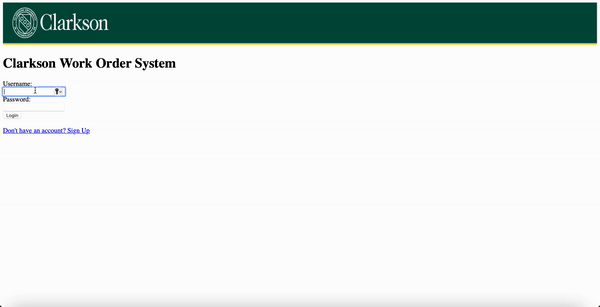

# Clarkson Work-Order System 

Website that allows occupants of a building to
report problems regarding infrastructure of that
building, allows managers to assign technicians
to work on the problem, and provides an
interface for technicians to log hours and notes
against the work order.


## Authors

- [Michelle A. McGill](https://github.com/mapmcgill)
- [Siva Ram](https://github.com/KSiva199)


## Technogies Used

**Programming Language:** Python, Flask, JavaScript and HTML 

**Database:** phpMyAdmin and SQL


## Installation

Setting up a web hosting account
    
## Usage/Examples

```python
from flask import Flask
from flask import render_template
from flask import request,session, redirect, url_for, escape,send_from_directory,make_response 
from flask_session import Session
from datetime import timedelta
from datetime import datetime
from Users import Users
from WO import WO
from Assets import Assets
from Problem_Codes import Problem_Codes
from WOComm import WOComm
import time

#create Flask app instance
app = Flask(__name__,static_url_path='')

#Configure serverside sessions 
app.config['SECRET_KEY'] = '#########'
app.config['SESSION_PERMANENT'] = True
app.config['SESSION_TYPE'] = 'filesystem'
app.config['PERMANENT_SESSION_LIFETIME'] = timedelta(hours=5)
sess = Session()
sess.init_app(app)

@app.context_processor
def inject_user():
    return dict(me=session.get('user'))

#Basic root route - show the word 'homepage'
@app.route('/home')  #route name
def home(): #view function
    if checkSession() == False: 
        return render_template('/users/home.html')
    return render_template('/users/home.html') 
    
@app.route('/register')
def register():
    o=Assets()
    u =Users()
    o.getByField('ParentAsset','BHSnell')
    o.fo=o.dropDownList()
    print('here')
    print(o.getByField('ParentAsset','BHSnell'))
    action = request.args.get('action')
    if action is not None and action=='new':
        return render_template('/users/add.html',obj=u,obj1=o)
    if action is not None and action=='update':
        pkval = request.args.get('pkval')
        u.getById(pkval)
        return render_template('/users/update.html',user=u,obj1=o)
    if action is not None and action=='manager_update':
        pkval = request.args.get('pkval')
        u.getById(pkval)
        return render_template('/users/updateuser_manager.html',user=u,obj1=o)


@app.route('/manage_user',methods=['GET','POST'])
def manage_user():
    action = request.args.get('action')
    pkval = request.args.get('pkval')
    if action is not None and action=='new':
        o=Users()
        d = {}
        d['UserFirstName'] = request.form.get('UserFirstName')
        d['UserLastName'] = request.form.get('UserLastName')
        d['Username'] = request.form.get('Username')
        d['Password'] = request.form.get('Password')
        d['Password2'] = request.form.get('ConfirmPassword')
        d['PhoneNumber'] = request.form.get('PhoneNumber')
        d['LocationID'] = request.form.get('LocationID')
        d['Shop'] = 'None'
        d['Role'] = 'Requester'
        o.set(d)
        if o.verify_new()==True:
            o.insert()
            return render_template('/users/home.html',msg='User Added')
        else:
            return render_template('/users/add.html', obj = o)
    if action is not None and action=='update':
        o=Users()
        o.getById(pkval)
        o.data[0]['UserFirstName'] = request.form.get('UserFirstName')
        o.data[0]['UserLastName'] = request.form.get('UserLastName')
        o.data[0]['Username'] = request.form.get('Username')
        o.data[0]['Password'] = request.form.get('Password')
        o.data[0]['Password2'] = request.form.get('ConfirmPassword')
        o.data[0]['PhoneNumber'] = request.form.get('PhoneNumber')
        o.data[0]['LocationID']=request.form.get('LocationID')
        if session['user']['Role'] == 'Manager':
            o.data[0]['Role'] = request.form.get('Role')
            o.data[0]['Shop'] = request.form.get('Shop')
        if o.verify_update():
            o.update()
            if session['user']['Role'] == 'Manager':
                return render_template('/users/manager_option.html', title='Main menu',user=o) 
            elif session['user']['Role']=='Technician':
                return render_template('/users/technician_option.html', title='Main menu',user=o)
            else:
                return render_template('/users/requester_option.html', title='Main menu',user=o)  
    if pkval is None:
        o.getAll()
        return render_template('users/list.html',objs = o)
    if pkval == 'new':
        o.createBlank()
        return render_template('users/add.html',obj = o)
    else:
        o.getById(pkval)
        return render_template('users/manage.html',obj = o)
    
    
@app.route('/redirect_user', methods=['GET','POST'])
def redirect_user():
    u=Users()
    if session['user']['Role'] == 'Manager':
        return render_template('/users/manager_option.html', title='Main menu',user=u) 
    elif session['user']['Role']=='Technician':
        return render_template('/users/technician_option.html', title='Main menu',user=u)
    else:
        return render_template('/users/requester_option.html', title='Main menu',user=u) 

    
@app.route('/login_user',methods=['GET','POST'])
def login_user():
    if request.form.get('Username') is not None and request.form.get('Password') is not None:
        u = Users()
        if u.tryLogin(request.form.get('Username'),request.form.get('Password')):
            u.getById(u.data[0]['UserID'])
            #print(u.data)
            print('login ok')
            session['user'] = u.data[0]
            session['active'] = time.time()
            if session['user']['Role'] == 'Manager':
                return render_template('/users/manager_option.html', title='Main menu',user=u) 
            elif session['user']['Role']=='Technician':
                return render_template('/users/technician_option.html', title='Main menu',user=u)
            else:
                return render_template('/users/requester_option.html', title='Main menu',user=u) 
            
        else:
            print('login failed')
            return render_template('users/home.html', title='Login', msg='Incorrect username or password.')
    else:
        if 'msg' not in session.keys() or session['msg'] is None:
            m = 'Type your email and password to continue.'
        else:
            m = session['msg']
            session['msg'] = None
        return render_template('users/home.html', title='Login', msg=m)
```

```html



            <div style="color:red;">
                
                    
                        <div>{{ error }}</div>
                    
                
            </div>

            <div>
                <form method="POST" action="manage_user?action=new">
                    First Name:<br>
                    <input type="text" name="UserFirstName" required/>
                    <br>

                    Last Name:<br>
                    <input type="text" name="UserLastName"  required/>
                    <br>

                    Email Address:<br>
                    <input type="text" size="20" name="Username" placeholder="Your Email Address.." required/>
                    <br>

                    Password:<br>
                    <input type="password" class='password' name="Password" required/>
                    <br>

                    Re-type Password:<br>
                    <input type="password" class='confirmpassword' name="ConfirmPassword" required/>
                    <br>

                    Phone Number:<br>
                    <input type="number" size='12' name="PhoneNumber"  required/>
                    <br>

                    Location:<br>
                    <select name="LocationID" >
                             
                        
                            
                            <option value="" disabled selected >Please Choose</option> 
                           <option selected="true" value="{{ fo.value }}">{{ fo.text }}</option>
                            
                             
                            <option value="{{ fo.value }}">{{ fo.text }}</option>
                            
                        
                    </select>
            

                    <br>
                    <br>
                    <button type = "submit" id=submit >Submit</button>  
  
                    <button type = "reset" value = "Reset" >Reset</button>  

                </form>
            </div>

```

```sql
SELECT * FROM WorkOrders as wo
INNER JOIN Users AS u ON wo.RequesterID = u.UserID
INNER JOIN Assets AS a ON wo.AssetID = a.AssetID;

SELECT WorkOrders.WorkOrderID, WorkOrders.RequestDate, WorkOrders.Issue, WorkOrders.Status, WorkOrders.TechnicianID, Users.UserID, Users.UserFirstName, Users.UserLastName 
FROM WorkOrders 
INNER JOIN Users ON WorkOrders.TechnicianID = Users.UserID
```


## Demo

Here is the Quick Demo of our Work



